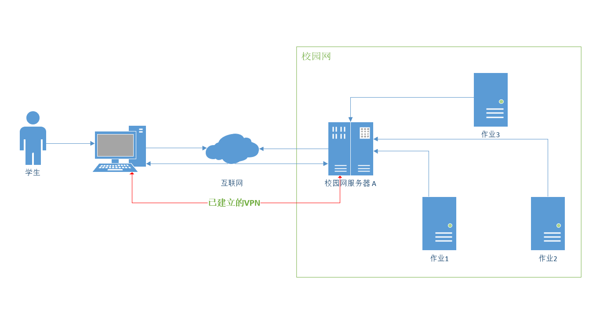
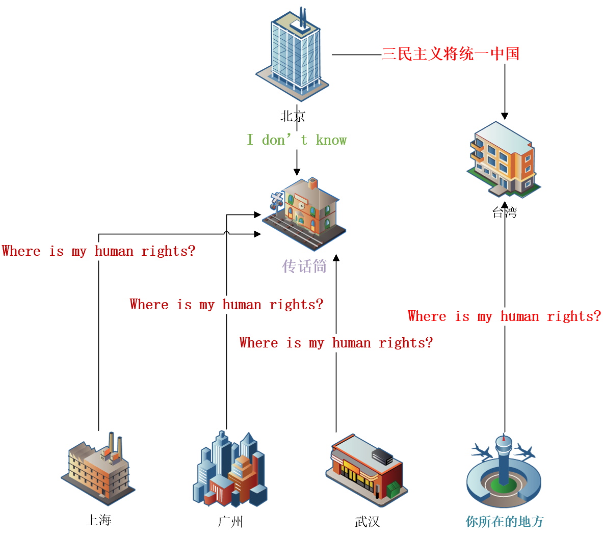

## 介绍

### UIFv2ray 与 v2ray

顾名思义，`UIFv2ray` 是一个基于 `v2ray` 的 UI（界面），即 `UI for v2ray`。`UIFv2ray` 封装了 `v2ray` 的功能，让用户更简便地使用 `v2ray`。`UIFv2ray` 的界面是基于浏览器的，只要你的电脑、手机或平板有浏览器，都可以操控 `UIFv2ray`，而且支持 Windows、Linux 和 Mac 三大平台。**傻瓜式的开箱即用是 `UIFv2ray` 不断追求的目标。**

`UIFv2ray` 非常依赖 `v2ray`，所以，我们有必要先介绍一下 `v2ray`。了解 `v2ray` 基本原理，`UIFv2ray` 的东西就会变得理所当然了。首先，我们要明确一点：**`v2ray` 不是 VPN！**

虚拟私人网络（英语：virtual private network，缩写：VPN）是常用于连接中、大型企业或团体间私人网络的通讯方法。它利用隧道协议（Tunneling Protocol）来达到发送端认证、消息保密与准确性等功能。举个例子：一个学校通常它都有它自己的一个只给学生们用的网络——校园网；不是学校内的人或不在学校地址范围内是无法使用校园网的，这样可以保证校园网的安全。

但是，一个学生回到他远离学校的家，又要使用校园网下载老师布置的作业。那怎么办呢？ 首先校园网这边部署一个服务器 A，我们假设学生的电脑名叫 B，B 首先需要通过隧道协议（通常是基于互联网的）连接上 A；A 和 B 相互认证，确认学生的确是该校学生。

A 问 B，你需要下载什么作业？因为 A 是处于校园网内的，A 可以访问属于该校园网内的资源，这时 A 可以帮助 B 下载作业，然后通过已经建立好的隧道传输到 B 处。然后，学生完成了家庭作业，然后把已完成的作业，发到 A 处说：帮我把作业提交到校园网内的那个老师那里吧！最后，皆大欢喜！

如图所示：

如图所示：

### TLS

传输层安全性协议（英语：Transport Layer Security，缩写作 TLS），及其前身安全套接层（Secure Sockets Layer，缩写作 SSL）是一种安全协议，目的是为互联网通信提供安全及数据完整性保障。

回顾 http，它是基于 TCP 协议 的应用层协议；它的过程大概是这样的：一个发自客户 A 的 http 请求（报文）通过 TCP 协议（协议里面带着 IP 地址，所以知道要发去哪里），分段地发送到目标主机 B，目标主机 B 组装后，收到客户 A 发来的 http 报文，然后根据实际回应 A。

请注意这个过程是完全明文的，什么意思呢？也就是说：A -> B 的过程中可以被监听，也就是 A -> C -> B ，这之间插入了 C，A 和 B 完全不知道，他们都以为报文都是直接发过来的，然而 C 却获得了完整的 A 的 http 报文，这样就达到了监听 A 和 B 的目的。

**如何不被监听？** 多亏了密码学的发展，我们可以完全可以隐藏自己的对话，而不被监听到。首先，你只需知道密码学有两大类加密方法：

#### ① 对称加密

设现有待加密字符串 $S_1$，我们随机生成一个密码 $K$，A 端通过密码 $K$ 加密 $S_1$ 得出一串不可阅读的字符串 $S_2$，我们把 $S_2$ 发送到 B 端，B 端根据 $K$ 解密 $S_2$ 得出原文，即 $S_1$

**对称的意思是：加密和解密都用同一个密码。** 具体到底是怎么加密的呢？这种加密是否能保证安全性，即不被解密？有兴趣的可以自行查阅相关资料。这个加解密的博弈过程在古代就已经开始了，有了计算机后，密码学迅速发展，博弈更加激励，而且十分有趣。然而在此，你只需知道一点点就足够了。

不难发现这种加密方法的缺陷：接发双方都需要事先约定好一个密码，这样接收方才能正确地解密。

优点：加解密快！（为什么？有兴趣自行去查阅相关资料，在这里你仅需知道即可）

#### ② 非对称加密

设现有待加密字符串 $S_1$，我们生成一**对**密码 $K_1$ 和 $K_2$ ，A 端通过密码 $K_1$ 加密 $S_1$ 得出一串不可阅读的字符串 $S_2$，我们把 $S_2$ 发送到 B 端，B 端根据 $K_2$ 解密 $S_2$ 得出原文，即 $S_1$，而且，B 端使用 $K_2$ 加密的字符串 $S_3$，只能使用 $K_1$ 解密。

**非对称的意思是：加密和解密不用同一个密码。**

缺点：加解密极慢！

优点：接发双方的加解密过程使用不同密码。

### 身份认证

**美好的一天开始了：**

假如你现在像要访问 http://UIFv2ray.org 。首先，你会在浏览器网址，然后回车。

① 浏览器问 http://UIFv2ray.org 的服务器 A：你是 http://UIFv2ray.org 吗？

② A 回答道：我是

③ 浏览器收到 A 的肯定回答后，你说道：好的，我是 007 特工；明天，我打算刺杀刁远凹，请给予支持！

④ A 回答道：好的，明天准时到。

**第二天：你被判死刑，并立刻执行！**

---

一条生命就这样逝去了，一切的起因都是你缺少一个 s。如果时光可以重来：

**美好的一天又开始了：**

假如你现在像要访问 https://UIFv2ray.org 。首先，你会在浏览器网址，然后回车。

① 浏览器问 https://UIFv2ray.org 的服务器 A：你是 https://UIFv2ray.org 吗？

② A 回答道：我是

③ 浏览器问道：请提供证件！

④ A 回答道：我的党员证件是：xxxx，颁发证件机构是：中国共产党！

⑤ 浏览器使用中国共产党的专属验钞机，检查了 A 的证件。

⑥ 的确是有效证件。通过！

⑦ 经过了验证，你和服务器 A 终于可以密谋中国梦了！

**第二天：你被判死刑，并立刻执行！**

---

为什么？ 我都验证了，还死了？

你的确验证了证件是有效证件，然而使用这有效证件的人真的是那个人吗？世界上总是有一些人，喜欢偷有效证件，然后去冒认身份。

---

如果时光可以重来，我会利用非对称加密。根据非对称加密的定义（见上），我们有：$S_1、S_2、K_1、K_2$

假如你现在像要访问 https://UIFv2ray.org 。首先，你会在浏览器网址，然后回车。

① 浏览器问 https://UIFv2ray.org 的服务器 A：你是 https://UIFv2ray.org 吗？

② A 回答道：我是

③ 浏览器问道：请提供证件！

④ A 回答道：我的党员证件是：$S_2$，颁发证件机构是：中国共产党！

⑤ 浏览器使用中国共产党的专属密码 $K_2$ 解密 $S_2$ 得出 $S_3$。

⑥ 假如 $S_3 == S_1$，即说明验证成功！

⑦ 经过了验证，你和服务器 A 终于可以密谋中国梦了！

**第二天：中华民族伟大复兴！**

看不懂有什么特别？对的，上面的描述忽略了两个细节：$S_1$ 具体等于什么？$K_1$ 怎么没用到？

到此，我相信你已经很迷茫了，再进一步，验证过身份后，我们还用对称加密，减少加解密过程的时耗，很复杂.... 再说下去只会增加你的疑惑，所以我就不解释了，有兴趣自己去查阅资料。

你只需知道：**我们保证了接收两方的安全，并且保证了当有心人冒认身份时会识别出来！**
